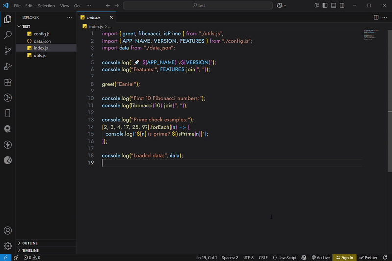

# VS Code Import Hover Preview


A VS Code extension that lets you **hover over an import path** to instantly preview the file’s contents...

# VS Code Import Hover Preview

A VS Code extension that lets you **hover over an import path** to instantly preview the file’s contents — with syntax highlighting, configurable preview lines, and a click-to-open option.

---

## ✨ Features

- **Hover Preview on Import Path** — Instantly see the contents of imported files.
- **Syntax Highlighting** — Readable previews with keyword coloring.
- **Configurable Preview Lines** — Show 5, 10, 20+ lines, your choice.
- **Click to Open File** — Open the file in a new tab directly from the tooltip.

---

## 🚀 Installation

1. Download from the [VS Code Marketplace](https://marketplace.visualstudio.com/items?itemName=0xDaniiel.vscode-import-hover-preview)
2. Or clone and install locally:

```bash
git clone https://github.com/0xDaniiel/vscode-import-hover-preview.git
cd vscode-import-hover-preview
npm install
```

## 📖 Usage

1. Hover over any import path (e.g., `import x from './file.js'`).
2. A tooltip will appear with the file’s preview.
3. Click inside the tooltip to open the file fully.

## ✨ Features

| Feature             | Description                         |
| ------------------- | ----------------------------------- |
| Hover Preview       | See file contents on hover          |
| Syntax Highlighting | Color-coded preview for readability |
| Configurable Lines  | Choose how many lines to display    |
| Click-to-Open       | Open the file directly from tooltip |

---

## 🎥 Demo



## 🛠 Configuration

- `importHoverPreview.previewLines` — Number of lines to show _(default: 10)_.

---

## 📜 License

[ISC](LICENSE.txt)
